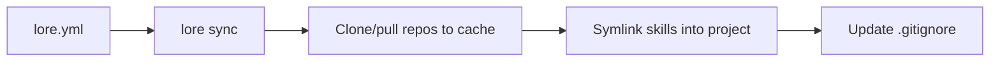

# Loremaster


Declarative skill syncer for AI coding tools. Define your skills in a manifest, fetch them from git repos, and symlink them into your project — no manual copying, no git leakage.

## Table of Contents

- [Overview](#overview)
- [Supported Tools](#supported-tools)
- [Installation](#installation)
- [Quick Start](#quick-start)
- [Configuration](#configuration)
- [Commands](#commands)
- [How It Works](#how-it-works)
- [Shell Completions](#shell-completions)
- [Development](#development)
- [License](#license)

## Overview

`lore` keeps AI coding skills (prompts, commands, workflows) synchronized across projects. You declare what you need in `lore.yml`, and loremaster handles cloning, caching, linking, and gitignore management.

Sync pipeline: read the manifest, clone repos to cache, symlink skills into the project, update `.gitignore`.



**Key properties:**

- **Declarative** — one YAML manifest per project
- **Symlink-first** — upstream changes propagate automatically
- **Cache-backed** — repos cloned once to `~/.local/share/loremaster/`
- **Git-safe** — synced skills are auto-excluded from your project's `.gitignore`
- **Partial failure isolation** — one bad source does not block the rest

## Supported Tools

| Provider   | Skill Directory      |
|------------|----------------------|
| Claude Code | `.claude/skills/`   |
| OpenCode    | `.opencode/skills/` |

## Installation

**Requirements:** Go 1.24+

```bash
git clone https://github.com/GyroZepelix/loremaster.git
cd loremaster
go build -o lore .
```

Move the binary somewhere on your `$PATH`:

```bash
mv lore ~/.local/bin/
```

## Quick Start

```bash
# 1. Navigate to a project that uses Claude Code or OpenCode
cd ~/my-project

# 2. Initialize — auto-detects your AI tool and writes a skeleton lore.yml
lore init

# 3. Edit lore.yml to declare your skill sources
cat lore.yml
```

```yaml
provider: claude
skills:
  - source: git@github.com:you/your-skills.git
    ref: main
    include: [commit-message, code-review]
    type: soft
```

```bash
# 4. Sync — clones the repo, symlinks skills, updates .gitignore
lore sync
# Synced 2 skills from 1 sources
```

## Configuration

`lore.yml` can live in your project root, `.claude/`, or `.opencode/`. Loremaster searches these locations relative to the current directory via `Locate()`.

### Scope

**Project scope** — Place `lore.yml` at the project root or inside `.claude/lore.yml` / `.opencode/lore.yml`. Run `lore sync` from the project directory.

**Global scope** — Place `lore.yml` at `~/lore.yml` or `~/.claude/lore.yml` and run `lore sync` from `~`. The recommended location is `~/.claude/lore.yml` to keep your home directory clean. There is no automatic `~/` fallback — global scope works because `Locate()` searches relative to the directory you invoke `lore sync` from.

Note: there is no config merging between project and global. Each `lore sync` invocation uses exactly one `lore.yml`. If no `lore.yml` is found in any of the search locations, `lore sync` exits with an error.

### Schema

```yaml
provider: claude          # required: claude | opencode
skills:
  - source: <git-url>     # required: any git-cloneable URL or local path
    ref: main              # optional: branch, tag, or commit SHA (default: HEAD)
    include: [skill-a]     # required: list of skill directory names to sync
    type: soft             # optional: soft (symlink) | hard (copy) — default: soft
```

### Linking Modes

- **soft** (default) — Creates symlinks pointing to the cached repo. Edits in the cache propagate to all projects using that skill.
- **hard** — Copies the skill directory into your project. Loremaster tracks a `.lore-checksum` file and warns before overwriting local modifications.

## Commands

```text
lore init                   Bootstrap lore.yml with provider auto-detection
lore sync                   Fetch sources and link skills into your project
lore completion <shell>     Generate shell completions (bash, zsh, fish)
lore --version              Print version
lore help [command]         Show help
```

## How It Works

1. **Parse** — Reads `lore.yml` and validates the manifest.
2. **Fetch** — Clones new repos (or pulls existing ones) into `~/.local/share/loremaster/`. Checks out the specified ref.
3. **Link** — Symlinks (or copies) each declared skill into the provider's skill directory.
4. **Clean** — Removes stale skills from previous syncs that are no longer declared.
5. **Gitignore** — Adds managed entries to `.gitignore` under a `# Managed by loremaster` section. Idempotent and non-destructive.

If you set `$XDG_DATA_HOME`, loremaster uses it as the cache root. Otherwise, it defaults to `~/.local/share/loremaster/`.

## Shell Completions

```bash
# Bash
lore completion bash > ~/.bashrc.d/lore.bash
source ~/.bashrc.d/lore.bash

# Zsh
lore completion zsh > "${fpath[1]}/_lore"

# Fish
lore completion fish > ~/.config/fish/completions/lore.fish
```

## Development

```bash
# Run tests
go test ./...

# Build
go build -o lore .
```

### Project Structure

```text
cmd/                CLI commands (init, sync, completion)
internal/
  config/           YAML parsing and validation
  provider/         Tool-specific path resolution and detection
  git/              Clone/pull/checkout via go-git
  sync/             Core sync orchestration and linking
  cache/            Repo cache management and URL normalization
  gitignore/        Idempotent .gitignore management
```

## License

[GNU General Public License v2.0](https://www.gnu.org/licenses/old-licenses/gpl-2.0.html)
