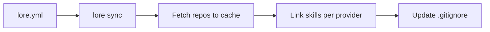
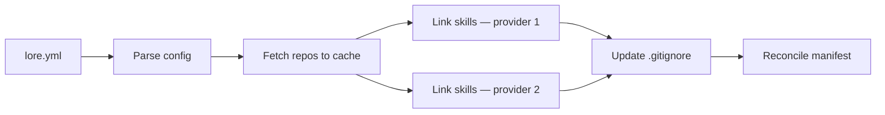

# Loremaster


Declarative skill syncer for AI coding tools. Define your skills in a config file, fetch them from git repos, and symlink them into your project — no manual copying, no git leakage. Supports profiles, multi-provider syncing, and subdirectory skill includes.

## Table of Contents

- [Overview](#overview)
- [Supported Tools](#supported-tools)
- [Installation](#installation)
- [Quick Start](#quick-start)
- [Configuration](#configuration)
- [Commands](#commands)
- [How It Works](#how-it-works)
- [Shell Completions](#shell-completions)
- [Development](#development)
- [License](#license)

## Overview

`lore` keeps AI coding skills (prompts, commands, workflows) synchronized across projects. You declare what you need in a config file (`lore.yml` or a profile-specific `lore-<profile>.yml`), and loremaster handles cloning, caching, linking, and gitignore management.



**Key properties:**

- **Declarative** — one YAML config per project (or per profile)
- **Multi-provider** — sync skills to Claude Code, OpenCode, or both at once
- **Profile-aware** — maintain separate skill sets per profile (`lore-dev.yml`, `lore-review.yml`, etc.)
- **Symlink-first** — upstream changes propagate automatically
- **Cache-backed** — repos cloned once to `~/.local/share/loremaster/`
- **Git-safe** — synced skills are auto-excluded from your project's `.gitignore`
- **Partial failure isolation** — one bad source does not block the rest

## Supported Tools

| Provider   | Skill Directory      |
|------------|----------------------|
| Claude Code | `.claude/skills/`   |
| OpenCode    | `.opencode/skills/` |

## Installation

**Requirements:** Go 1.24+

### go install (recommended)

```bash
go install github.com/GyroZepelix/loremaster/cmd/lore@latest
```

This installs the `lore` binary to your `$GOBIN` (defaults to `$GOPATH/bin` or `~/go/bin`). Make sure it's on your `$PATH`.

### Build from source

```bash
git clone https://github.com/GyroZepelix/loremaster.git
cd loremaster
go build -o lore ./cmd/lore
```

Move the binary somewhere on your `$PATH`:

```bash
mv lore ~/.local/bin/
```

## Quick Start

```bash
# 1. Navigate to a project that uses Claude Code or OpenCode
cd ~/my-project

# 2. Initialize — auto-detects your AI tool and writes a skeleton lore.yml
lore init

# 3. Edit lore.yml to declare your skill sources
cat lore.yml
```

```yaml
provider: claude
skills:
  - source: git@github.com:you/your-skills.git
    ref: main
    include: [commit-message, code-review]
    type: soft
```

```bash
# 4. Sync — clones the repo, symlinks skills, updates .gitignore
lore sync
# Synced 2 skills from 1 sources
```

### Profiles Example

```bash
# Create a profile for development-specific skills
lore init -p dev
# Edit lore-dev.yml to declare your dev skill sources

# Sync the dev profile
lore sync -p dev
```

### Multi-Provider Example

```yaml
# lore.yml — sync skills to both Claude Code and OpenCode
provider: [claude, opencode]
skills:
  - source: git@github.com:you/your-skills.git
    ref: main
    include: [commit-message, code-review]
    type: soft
```

## Configuration

`lore.yml` can live in your project root, `.claude/`, or `.opencode/`. Loremaster searches these locations relative to the current directory via `Locate()`.

### Scope

**Project scope** — Place `lore.yml` at the project root or inside `.claude/lore.yml` / `.opencode/lore.yml`. Run `lore sync` from the project directory.

**Global scope** — Place `lore.yml` at `~/lore.yml` or `~/.claude/lore.yml` and run `lore sync` from `~`. The recommended location is `~/.claude/lore.yml` to keep your home directory clean. There is no automatic `~/` fallback — global scope works because `Locate()` searches relative to the directory you invoke `lore sync` from.

Note: there is no config merging between project and global. Each `lore sync` invocation uses exactly one config file. If no config file is found in any of the search locations, `lore sync` exits with an error.

### Schema

```yaml
provider: claude                    # string or list: claude | opencode | [claude, opencode]
skills:
  - source: <git-url>              # required: any git-cloneable URL or local path
    ref: main                       # optional: branch, tag, or commit SHA (default: HEAD)
    include:                        # required: list of skill paths to sync
      - skill-a                     # flat name (backward compat)
      - loa/brainstorm              # subdirectory include
      - deep/skill:my-tool          # src:dst mapping
    type: soft                      # optional: soft (symlink) | hard (copy) — default: soft
```

### Profiles

Profiles let you maintain separate skill sets for different workflows (e.g., development vs. review).

- **Config naming:** `lore-<profile>.yml` (e.g., `lore-dev.yml`, `lore-review.yml`)
- **Default profile:** `-p default` maps to `lore.yml` — no `-p` flag also uses `lore.yml` (backward compat)
- **Profile names:** lowercase alphanumeric + hyphens, max 64 characters
- **Create a profile:** `lore init -p <profile>` creates a `lore-<profile>.yml` skeleton
- **Sync a profile:** `lore sync -p <profile>`
- **Multiple profiles coexist** — the manifest tracks per-profile skill ownership to prevent cross-profile clobbering
- **Orphan cleanup:** if you delete a profile's config file, `lore sync --prune` removes that profile's skills from disk, `.gitignore`, and manifest

### Multi-Provider

Sync skills to multiple AI tool directories in one pass.

- **Single provider:** `provider: claude` — backward compatible (v0.1.x format)
- **Multiple providers:** `provider: [claude, opencode]` — skills are synced to both `.claude/skills/` and `.opencode/skills/`
- **Two-phase sync:** git repos are fetched once, then skills are linked per-provider
- `.gitignore` entries are created for all provider paths
- Duplicate providers and empty lists are rejected at parse time

### Subdirectory Includes

Organize skills into nested directories using `/` path syntax.

- **Subdirectory:** `include: [loa/brainstorm]` — creates `<provider>/skills/loa/brainstorm/` symlink
- **Mapped name:** `include: [deep/skill:my-tool]` — maps source `deep/skill/` to destination `my-tool/`
- **Flat name:** `include: [brainstorm]` — still works (backward compat)
- Path traversal (`..`) is rejected
- Absolute paths are rejected
- Overlapping prefixes are rejected (e.g., `loa` and `loa/brainstorm` cannot coexist)

### Manifest

When profiles are used, loremaster creates a `.lore-manifest.yml` file in the project root to track per-profile skill ownership.

- Auto-created on first non-default profile sync (or when multi-provider is used with the default profile)
- Auto-added to `.gitignore`
- Single-provider + default profile (v0.1.x behavior): no manifest is created
- If the manifest is corrupted, a warning is printed and sync proceeds as if no manifest exists

### Linking Modes

- **soft** (default) — Creates symlinks pointing to the cached repo. Edits in the cache propagate to all projects using that skill.
- **hard** — Copies the skill directory into your project. Loremaster tracks a `.lore-checksum` file and warns before overwriting local modifications.

## Commands

```text
lore init                        Bootstrap lore.yml with provider auto-detection
lore init -p <profile>           Create lore-<profile>.yml for a named profile
lore sync                        Fetch sources and link skills into your project
lore sync -p <profile>           Sync a specific profile's config
lore sync --prune                Remove orphaned profile skills from disk and gitignore
lore completion <shell>          Generate shell completions (bash, zsh, fish)
lore --version                   Print version
lore help [command]              Show help
```

> **Note:** Concurrent syncs targeting the same project directory are unsupported. Running multiple `lore sync` processes simultaneously may corrupt `.gitignore` or the manifest file.

## How It Works



1. **Parse** — Reads the config file (`lore.yml` or `lore-<profile>.yml`) and validates it.
2. **Fetch** — Clones new repos (or pulls existing ones) into `~/.local/share/loremaster/`. Checks out the specified ref. This happens once regardless of how many providers are configured.
3. **Link** — For each provider, symlinks (or copies) each declared skill into the provider's skill directory (e.g., `.claude/skills/`, `.opencode/skills/`).
4. **Clean** — Removes stale skills from previous syncs that are no longer declared. When profiles are active, stale reconciliation is scoped to the manifest — only skills owned by the current profile are candidates for removal.
5. **Gitignore** — Adds managed entries to `.gitignore` under a `# Managed by loremaster` section. Idempotent and non-destructive.

If you set `$XDG_DATA_HOME`, loremaster uses it as the cache root. Otherwise, it defaults to `~/.local/share/loremaster/`.

## Shell Completions

```bash
# Bash
lore completion bash > ~/.bashrc.d/lore.bash
source ~/.bashrc.d/lore.bash

# Zsh
lore completion zsh > "${fpath[1]}/_lore"

# Fish
lore completion fish > ~/.config/fish/completions/lore.fish
```

## Development

```bash
# Run tests
go test ./...

# Build
go build -o lore ./cmd/lore
```

### Project Structure

```text
cmd/
  lore/             Main entry point (go install target)
  *.go              CLI commands (init, sync, completion)
internal/
  config/           YAML parsing, validation, include parsing, and profile location
  manifest/         Profile-scoped skill tracking (.lore-manifest.yml)
  provider/         Tool-specific path resolution and detection
  git/              Clone/pull/checkout via go-git
  sync/             Core sync orchestration (two-phase fetch-then-link)
  cache/            Repo cache management and URL normalization
  gitignore/        Idempotent .gitignore management
```

## License

[GNU General Public License v2.0](https://www.gnu.org/licenses/old-licenses/gpl-2.0.html)
